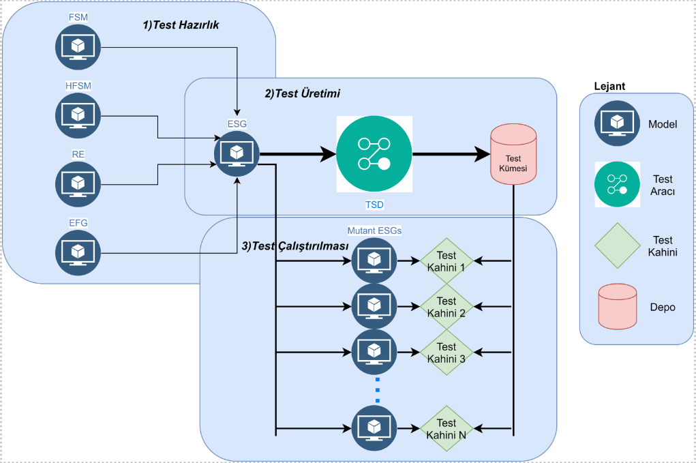
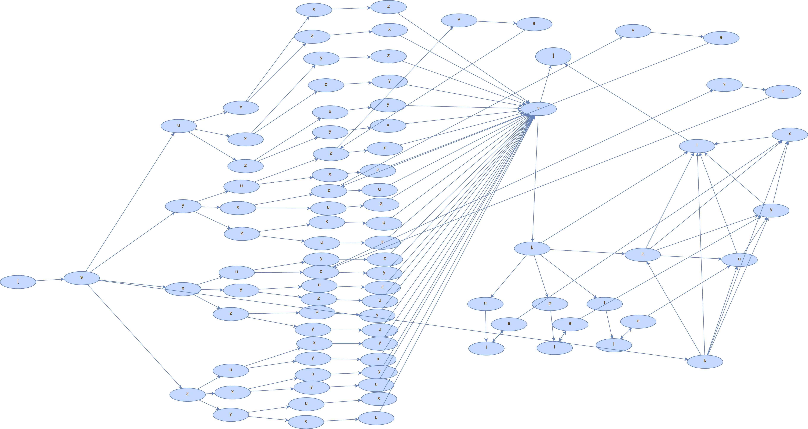

# Grafiksel Kullanıcı Arayüzü Testi İçin Bir Uçtan Uca Model Tabanlı Yaklaşım

Bu repository EMO Dergi için gönderilen Grafiksel Kullanıcı Arayüzü Testi İçin Bir Uçtan Uca Model Tabanlı Yaklaşım adlı makalede yapılan çalışma için hazırlanmıştır.

## Makale Özeti

Model tabanlı Grafiksel Kullanıcı Arayüz (GUI) testi, yazılım GUI testi içerisinde önemli bir yer tutmaktadır. Manuel test, zaman alıcı bir iştir ve büyük ölçüde hataya açıktır. Yazılım test topluluğunun uzun yıllardır üzerinde çalıştığı ve genel kullanımda olan birkaç test modeli vardır. Bu makale, model tabanlı GUI testinde kullanılan farklı modelleri incelemektedir. Test senaryoları oluşturmak ve bunları tek bir modelde birleştirmek amacıyla, kabul gören birkaç modelin Olay Sıra Çizgelerine (ESG) nasıl dönüştürüleceğine ilişkin bir yöntem önerilmiştir ve bunun kullanımını örnekleyen bir vaka çalışması sunulmuştur. Ayrıca bu makalede diğer modellerden dönüşümle elde edilen ESG modelinden test kümelerinin üretilmesi ve çalıştırılmasını içeren bir yaklaşım tanıtılmıştır. Deneysel çalışmalar öne sürülen bu yaklaşımın uygun ve etkili olduğunu göstermiştir. Bu kapsamda ESG’den elde edilen 20 mutant için öne sürülen yaklaşım en yüksek seviyede mutasyon skoru sonucunu vermiştir.

<figure>

<figcaption>Fig.1 - Genel Görünüm.</figcaption>

</figure>

[1.Test Hazırlık](#1)

* [1.1.Model üretimi(Manuel)](#1.1)
* [1.2.Mutant yaratımı(Manuel)](#1.2)
* [1.3.Test Kümesi Üretimi(Otomatik)](#1.3)

[2.Testlerin Çalıştırılması](#2)

* [2.1.Testlerin Çalıştırılması(Otomatik)](#2.1)

Aşağıda bölümlerin detayları ve kullanılan yardımcı araçlar açıklanmaktadır.

## 1.Test Hazırlık

Makaledeki bölüm 3.2’de ifade edildiği gibi test hazırlık aşamasında FSM, HFSM, RE ve EFG modelleri basitlik, genellik ve ölçeklenebilirlik avantajları nedeniyle ESG modeline dönüştürülür. Dönüşümler için gerekli algoritmalar daha önce yine Bölüm 3.2.’de verilmişti. Görsel olarak ISELTA web sitesinin “Special” formunun diğer modelleri de Bölüm 3.2’deki şekillerde dönüşüm tanımları ve örnekleri aşamasında verilmiştir. Test hazırlık aşamasında diğer modellerden dönüşüm yapılacağı gibi ayrıca kullanıcılar sistemlerini ESG’de modelleyip doğrudan yönteme de aktarabilirler.

**1.1** Makalede model dönüşümlerinin nasıl yapılacağı verilmiştir. Ancak bu çalışmada kullanılan model deneysel çalışmada kullanmak amacıyla elle Test Suite Designer [1] adlı araç içerisinde üretilmiştir. Test Suite Designer aracı ESG modellerini üretmek için tasarlanmış bir yazılımdır.

### Deneysel Çalışma - Iselta Special Formu

Lütfen aşağıda verilen Special Form XXX dosyasını indirin. Ardından bu dosyayı araçlar bölümünde verilen Test Suite Designer programı ile açın. Special Form ESG modeli için Şekil 2'ye bakın.

* CS 1: ISELTA [http://iselta.ivknet.de/](http://iselta.ivknet.de/) "Special" Form

<figure>

<figcaption>Fig.2 - Special Formun ESG Modeli</figcaption>

</figure>

**1.2** Mutant yaratım kısmı Iselta Special formu üzerinde manuel olarak değişikliklerle yapılmıştır. Special form'da bulunan form elementlerinin normalde doldurulması zorunludur. Yaratılan mutantlarda bu zorunluluk adımlarından bazıları kaldırılmıştır ve formu o değerler girilmeden kayıt edilmesi imkanı sağlanmıştır.

**1.3** Test üretimi aşaması da Test Suite Designer adlı aracın yardımıyla yapılmıştır. Test Suite Designer bize sistemdeki olası patikaları çıkardan bir test dizisi üretir.

Yaratılan test dizisi bu repo altında bulunan *testsuite-emo.txt* adlı dosyada görülebilir.

## 2.Testlerin Çalıştırılması

Testlerin çalıştırılması aşamasında orijinal modelden üretilen test disizi mutant sistemler üzerinde çalıştırılır (Pozitif test).

**2.1** Selenium test script'i kullanılarak yaratılan test dizilerini Iselta sistemi üzerinde Selenium aracıyla çalıştırabiliriz. Bu sciprt selenium'u ve chrome web driver'ını kullanır. Yaratılan test dizisi dosyasını alarak parse eder ve tek tek her bir harf'e karşılıık gelen test adımını gerçek sistem üzerinde çalıştırır. Sistem herhangi bir hata vermezse başarılı kayıt basar. Hata olması durumda hata verdiğini belirtir.

## Sonuçlar

Aşağıda testlerin sonuçları görülmektedir.

<figure>

<figcaption>Table.1 - Special Form Test Sonuçları</figcaption>

</figure>

## Araç Desteği

ESG modelini üretmek için Test Suite Designer adlı uygulamayı kullandık.

* [1]Test Suite Designer, online olarak [http://download.ivknet.de/](http://download.ivknet.de/) adresinde mevcuttur.
* [2]Selenium, online olarak [https://www.seleniumhq.org/](https://www.seleniumhq.org/)  adresinde mevcuttur.
* [3]Test script dosyası, repo içindeki Java dosyası kullanılabilir [Link](ZeroOriginalFsmTests.java)

*Not: Herhangi bir problem ya da geribildiriminiz olması durumunda Onur Kilincceker (onurkilincceker@gmail.com) ile iletişime geçebilirsiniz.*
